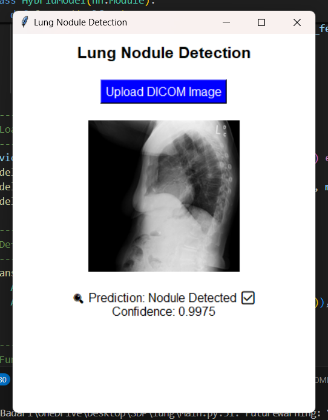
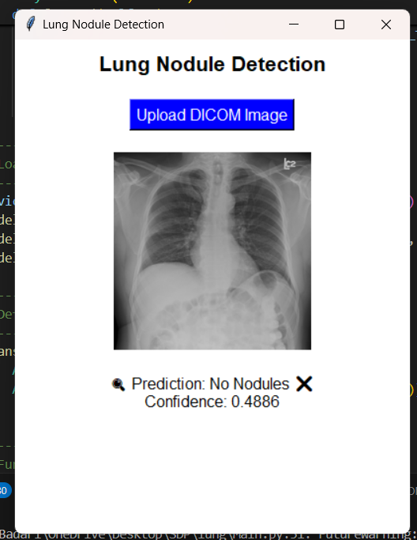

# Lung Nodule Detection Using Hybrid Model

## Dataset
The dataset used in this project is from [LIDC-IDRI (Kaggle)](https://www.kaggle.com/datasets/raddar/nodules-in-chest-xrays-lidcidri/data?select=lidc_metadata.csv). It contains metadata and images of lung nodules detected in chest X-rays.

## Project Overview
Lung nodules in chest X-rays are an early indicator of lung diseases, including lung cancer. Early and accurate detection is crucial for timely intervention.

This project presents a **hybrid deep learning model** that enhances detection accuracy and speed by combining:
- **EfficientNet (CNN)** – Extracts spatial features.
- **Vision Transformer (ViT)** – Captures long-range dependencies in images.
- **BiLSTM** – Identifies sequential patterns in lung scan slices.

### Key Features
- **Lightweight yet powerful model**
- **Achieves high accuracy (~98.96%)**
- **Promising solution for automated lung disease detection**

## Methodology
1. **Preprocessing:** Image augmentation, normalization, and resizing.
2. **Feature Extraction:**
   - **EfficientNet & ViT** extract spatial features.
   - **BiLSTM** captures sequential dependencies in lung scan slices.
3. **Training & Optimization:**
   - Fine-tuned on Kaggle dataset with **Adam optimizer & learning rate scheduling**.
4. **Evaluation:**
   - Achieved high accuracy (~98.96%) on test data.
   - Metrics: **Accuracy, Precision, Recall, F1-Score**.

## Installation & Usage
### Step 1: Clone the Repository
```bash
git clone https://github.com/saibadarinadh/Lung-Nodule-Detection-Using-Hybrid-Model.git
cd Lung-Nodule-Detection-Using-Hybrid-Model
```
### Step 2: Download the Dataset
Download the dataset from Kaggle and place it in the appropriate directory.

### Step 3: Install Dependencies
```bash
pip install -r requirements.txt
```
### Step 4: Train the Model
```bash
python train.py
```
Or use a Jupyter Notebook:
```bash
jupyter notebook
```
### Step 5: Run the Main File
```bash
python main.py
```

## Sample Outputs
| Home | Output-1 | Output-2 |
|------------------|--------------|--------------|
|  |  |  | 


# Lung-Nodule-Detection-Using-Hybrid-Model
