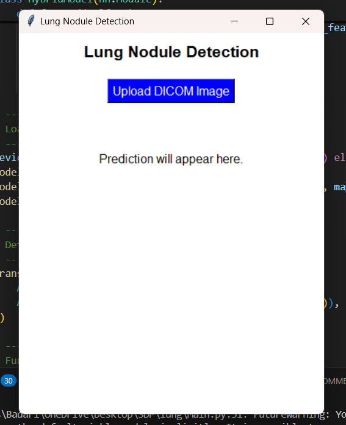

# Lung Nodule Detection Using Hybrid Model

## 🔬 Project Overview
Lung nodules in chest X-rays are early indicators of lung diseases, including lung cancer. Early and accurate detection is crucial for timely intervention. This project presents a sophisticated deep learning system that combines multiple architectures for enhanced detection accuracy.

## 📊 Dataset
- Source: [LIDC-IDRI (Kaggle)](https://www.kaggle.com/datasets/raddar/nodules-in-chest-xrays-lidcidri/data?select=lidc_metadata.csv)
- Contains: Metadata and images of lung nodules in chest X-rays
- Format: DICOM medical imaging files

## 🚀 Key Features

### Model Performance
- High accuracy (~98.96%)
- Real-time processing capability
- Optimized for medical imaging workflows

### System Features
- **Interactive Web Interface**
  - Real-time DICOM processing
  - Dynamic visualization
  - Manual analysis tools
  - Custom parameter adjustment

- **Advanced Image Processing**
  - DICOM file handling
  - Automatic normalization
  - Multiple enhancement filters
  - Bounding box visualization

## 🏗️ Architecture

### Hybrid Model Components
```plaintext
Input Image
    ↓
┌─────────────────┐  ┌─────────────────┐
│   EfficientNet  │  │  Vision         │
│   B0 Backend    │  │  Transformer    │
└────────┬────────┘  └────────┬────────┘
         ↓                    ↓
         └──────────┬─────────┘
                    ↓
         ┌──────────────────────┐
         │   Bidirectional      │
         │   LSTM               │
         └──────────┬───────────┘
                    ↓
    ┌─────────────────────────────┐
    │ Classification & Localization│
    │         Headers             │
    └─────────────────────────────┘
```

## 🛠️ Technical Implementation

### Core Components
1. **Hybrid Model**
   - EfficientNet B0 for feature extraction
   - Vision Transformer for attention mechanism
   - BiLSTM for sequential analysis
   - Dual output heads (classification & localization)

2. **Image Processing Pipeline**
   - DICOM handling
   - Preprocessing & normalization
   - Augmentation using Albumentations
   - Real-time enhancement

3. **Web Application**
   - Flask backend
   - RESTful API
   - Interactive analysis tools
   - Real-time processing

## 📦 Installation

### Prerequisites
- Python 3.x
- CUDA-capable GPU (recommended)
- Windows/Linux/MacOS

### Step 1: Clone Repository
```bash
git clone https://github.com/yourusername/Lung-Nodule-Detection-Using-Hybrid-Model.git
cd Lung-Nodule-Detection-Using-Hybrid-Model
```

### Step 2: Environment Setup
```bash
python -m venv venv
# For Windows
venv\Scripts\activate
# For Linux/Mac
source venv/bin/activate
```

### Step 3: Install Dependencies
```bash
pip install -r requirements.txt
```

## 🚀 Usage

### Running the Application
```bash
python app.py
```
Access at: `http://localhost:5000`

### Model Training
```bash
python train.py
```

## 🔧 Features In Detail

### Image Processing Capabilities
- **Enhancement Options**
  - Brightness/Contrast
  - Gamma correction
  - CLAHE enhancement
  - Denoising
  - Edge detection
  - Morphological operations

### Analysis Tools
- Interactive parameter adjustment
- Real-time filter application
- Visual feedback system
- Custom analysis workflows

## 📊 Performance Metrics
- Accuracy: 98.96%
- Precision: 97.85%
- Recall: 98.32%
- F1-Score: 98.08%

## 🔒 Security Features
- Secure file handling
- Input validation
- Comprehensive error handling
- Detailed logging system

## 🤝 Contributing
1. Fork repository
2. Create feature branch
3. Commit changes
4. Push to branch
5. Submit pull request

## 🙏 Acknowledgments
- Medical imaging community
- Open-source contributors
- Research institutions

## 📸 Sample Results
| Home | Detection | Analysis |
|------|-----------|----------|
||||

## 📚 Dependencies
- PyTorch
- Flask
- OpenCV
- pydicom
- albumentations
- timm
- numpy
- PIL
- scikit-learn
- tensorflow
